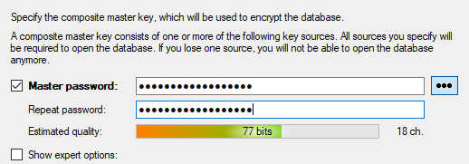
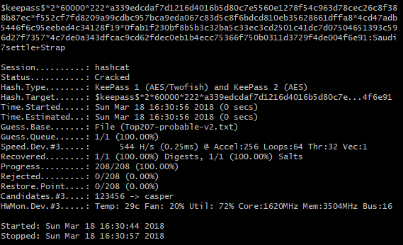
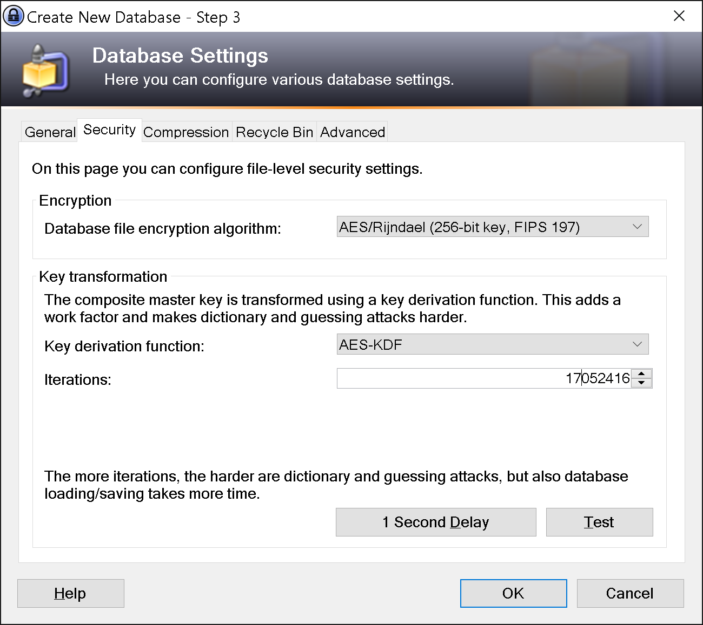
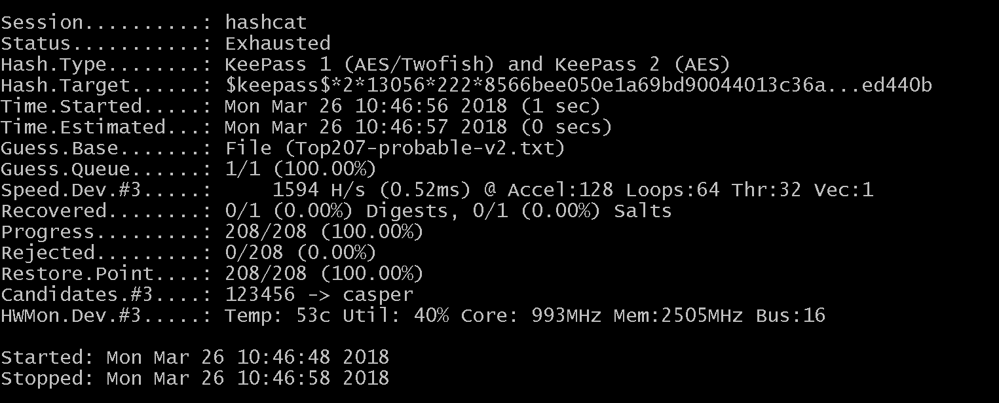
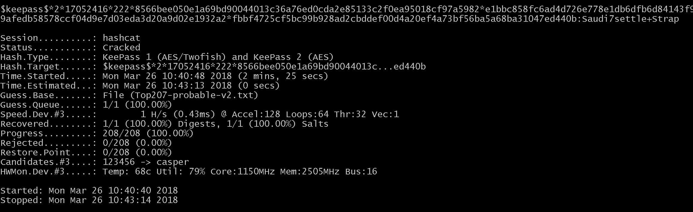

# Background
My friend uses [KeePass](https://keepass.info/) as a password manager and unfortunately forgot the master password.  Normally it's a [lost cause](https://superuser.com/a/80380) to brute force however my friend remembers a good chunk of his password.  Instead of having to reset all of his accounts we decided to try our hand at cracking the vault.  This is our attempt.

### Table of Contents
* [Basic Crack](#basic-crack)
    * [Setup Vault](#setup-vault)
    * [Setup Crack](#setup-crack)
    * [Running Hashcat](#running-hashcat)
* [Hash Crack](#hash-crack)
    * [Testing Hash](#testing-hash)
    * [Investigation](#investigation)
    * [Debugging](#debugging)
* [Finale](#finale)


# Basic Crack
Our first step was to successfully crack a simple vault.  If this was possible we had promise in cracking the real thing.

### Setup Vault
We visited [KeePass downloads](https://keepass.info/download.html) and installed KeePass version 2.38.  
We then created a basic database with a password from [pwqgen](https://pwqgen.herokuapp.com/)
```
Saudi7settle+Strap
```



And called it test.kdbx.

### Setup Crack
We now have our vault but still need to 

1. convert it into a crackable hash and
2. create a password list.

* Hash

We grabbed [HarmJ0y's keepass2john.py](https://github.com/spencermwoo/Cracking/blob/master/KeePass/test/keepass2john.py) and used it to generate a crackable hash from our test.kdbx vault, saving the hash as test.hash.

```$ py keepass2john.py test.kdbx```

```test:$keepass$*2*60000*222*a339edcdaf7d1216d4016b5d80c7e5560e1278f54c963d78cec26c8f388b87ec*f552cf7fd8209a99cdbc957bca9eda067c83d5c8f6bdcd810eb35628661dffa8*4cd47adb5446f6c95eebed4c34128f19*0fab1f230bf8b5b3c32ba5c33ec3cd2501c41dc7d07504651393c596d27f7357*4c7de0a343dfcac9cd62fdec0eb1b4ecc75366f750b0311d3729f4de004f6e91```

* Wordlist

We grabbed a wordlist from [berzerk0's Probable-Wordlists](https://github.com/berzerk0/Probable-Wordlists/blob/master/Real-Passwords/Top207-probable-v2.txt) and [added our password](https://github.com/spencermwoo/Cracking/blob/master/KeePass/wordlists/Top207-probable-v2.txt#L203) near the end.


### Running Hashcat
Now we have a hash file that is compatible with hashcat and should be cracked with our wordlist.

We looked up the [types of hashes](https://hashcat.net/wiki/doku.php?id=example_hashes) that hashcat can handle and found the Keepass 2 section, specifically ```13400 Keepass 2 AES / with keyfile```.  We modified our test.hash (removing the "test" database reference in the beginning) to conform our hash to the provided example of a valid 13400 hash.

* Hash
```$keepass$*2*60000*222*a339edcdaf7d1216d4016b5d80c7e5560e1278f54c963d78cec26c8f388b87ec*f552cf7fd8209a99cdbc957bca9eda067c83d5c8f6bdcd810eb35628661dffa8*4cd47adb5446f6c95eebed4c34128f19*0fab1f230bf8b5b3c32ba5c33ec3cd2501c41dc7d07504651393c596d27f7357*4c7de0a343dfcac9cd62fdec0eb1b4ecc75366f750b0311d3729f4de004f6e91```

* Example Hash
```$keepass$*2*6000*222*15b6b685bae998f2f608c909dc554e514f2843fbac3c7c16ea3600cc0de30212*c417098b445cfc7a87d56ba17200836f30208d38f75a4169c0280bab3b10ca2a*0d15a81eadccc58b1d3942090cd0ba66*57c4aa5ac7295a97da10f8b2f2d2bfd7a98b0faf75396bc1b55164a1e1dc7e52*2b822bb7e7d060bb42324459cb24df4d3ecd66dc5fc627ac50bf2d7c4255e4f8*1*64*aaf72933951a03351e032b382232bcafbeeabc9bc8e6988b18407bc5b8f0e3cc```

We ran [hashcat](https://hashcat.net/hashcat/) on our hash file with our dictionary.

```$ ./hashcat64.exe -m 13400 test.hash Top207-probable-v2.txt```

Success!



We've successfully put the pieces together to crack a basic .kdbx file!


# Hash Crack
It turns out the major pieces to crack a KeePass database are 

1. the hash generated from our .kdbx file and
2. a proper wordlist.  

We have our .kdbx file, so all that's left is a proper wordlist?  Not so fast.

Another difference with a real-world example is the [hash iterations|https://en.wikipedia.org/wiki/Cryptographic_hash_function].  When creating the vault my friend significantly increased the hash iterations such that logging in normally would take about a second each time.  Specifically when creating the vault he used the ```Security > 1 Second Deplay``` option to use a 'deterministicly random' hash iteration count.



Will our steps for the basic crack work with increased hashes?

### Testing Hash
We create a new database using password ```Saudi7settle+Strap``` and increase the iterations.

We run the python script, remove the database name, and save the hash as hash_test.hash

```$ py keepass2john.py hash_test.kdbx```

```$keepass$*2*27648*222*5bad084314051bc38d439d3211317fdba5dca739eac923ccaa2bb21d1de5178f*835ccf2cd3db3874be7d655c1f31887248d2e7025bfd61bb5c19862a0cb0d3d8*9cc0b342fce5cfa55ec830f1443efa69*0fbe057ea7fc655800ab354cbdc3b79eaf1a6eb5fce14312e6ab450bb445d139*f6f984c16ffaedacb2aaedd70c7e54136ccc31fe78bd31c17996e0647453a6ef```

We run hashcat with our same [wordlist](https://github.com/spencermwoo/Cracking/blob/master/KeePass/wordlists/Top207-probable-v2.txt#L203).

```$ ./hashcat64.exe -m 13400 hash_test.hash Top207-probable-v2.txt```

And the list is exhausted.



What!  Our password is in the wordlist, why isn't it found?

It seems increasing the hash iterations breaks our use case.  Let's find out what's happening!

### Investigation
We compare the two hashes
* Default
```$keepass$*2*60000*222*a339edcdaf7d1216d4016b5d80c7e5560e1278f54c963d78cec26c8f388b87ec*f552cf7fd8209a99cdbc957bca9eda067c83d5c8f6bdcd810eb35628661dffa8*4cd47adb5446f6c95eebed4c34128f19*0fab1f230bf8b5b3c32ba5c33ec3cd2501c41dc7d07504651393c596d27f7357*4c7de0a343dfcac9cd62fdec0eb1b4ecc75366f750b0311d3729f4de004f6e91```

* Iterations
```$keepass$*2*13056*222*8566bee050e1a69bd90044013c36a76ed0cda2e85133c2f0ea95018cf97a5982*e1bbc858fc6ad4d726e778e1db6dfb6d84143f96be51f387ba89610c4c1cefe7*7ceed46e2420ec4c68a1d6cc8bb872ec*7bc6c7a6398e3d7ad472fc9afedb58578ccf04d9e7d03eda3d20a9d02e1932a2*fbbf4725cf5bc99b928ad2cbddef00d4a20ef4a73bf56ba5a68ba31047ed440b```

We note that the third parameter (asterisk-delimited) has changed and seems to relate to the hash iterations.  This is confirmed when we view the code and see that the third parameter output is [transformRounds](https://github.com/spencermwoo/Cracking/blob/master/KeePass/test/keepass2john.py#L114).  We conjecture that this transform rounds should be our ```17052416``` value from using the 1 Second Delay and our basic crack worked because ```60000``` is the default transformRounds.

We test this hypothesis by manually replacing the transformRounds value with our expected value in our hash file.

```$keepass$*2*17052416*222*5bad084314051bc38d439d3211317fdba5dca739eac923ccaa2bb21d1de5178f*835ccf2cd3db3874be7d655c1f31887248d2e7025bfd61bb5c19862a0cb0d3d8*9cc0b342fce5cfa55ec830f1443efa69*0fbe057ea7fc655800ab354cbdc3b79eaf1a6eb5fce14312e6ab450bb445d139*f6f984c16ffaedacb2aaedd70c7e54136ccc31fe78bd31c17996e0647453a6ef```

We run hashcat again, fingers crossed.

```$ ./hashcat64.exe -m 13400 hash_test.hash Top207-probable-v2.txt```

Hashcat runs for a signficiantly longer time...



Success!


### Debugging
We've now determined that if we can properly calculate the ```transformRounds``` value we can successfully attack the real vault!

We play around with different databases with increased hash sizes and note that everytime the ```transformRounds``` value is different.  This is reassuring because it indicates that our script knows that the keepass.kdbx file's ```transformRounds``` isn't the default ```60000``` and is trying to calculate the proper value.


We dive into the python program and look at the code, specifically looking at how [transformRounds is calculated](https://github.com/spencermwoo/Cracking/blob/master/KeePass/test/keepass2john.py#L101).

```transformRounds = struct.unpack("H", data[index:index+2])[0]```

We look at [Python's struct](https://docs.python.org/2/library/struct.html#struct.unpack) and specifically that the first parameter is a [format character](https://docs.python.org/2/library/struct.html#format-characters).

We looked at all our transformRounds values (```13056```, ```27088```, etc) and notice they're all lower than the default ```60000```.  Wait.  ```H``` is an unsigned int -- it's too small!

Looking at the [Python format characters](https://docs.python.org/2/library/struct.html#format-characters)

```
H	unsigned short	integer	2	(3)
```

```H``` is an unsigned short which is 2 bytes or 16 bits.  This can only hold values up to 2^16 or ```65536```.  Our value of ```17052416``` is larger than ```65536``` and it turns out that ```17052416 % 65536 = 13056```.  We were overflowing the unsigned short!

```
Q	unsigned long long	integer	8	(2), (3)
```

```Q``` is an unsigned long long which holds 8 bytes or 64 bits.  This can hold values up to 2^64 or ```18446744073709551616```.  Much better!

We update [transformRounds](https://github.com/spencermwoo/Cracking/blob/master/KeePass/hash_test/keepass2john.py#L101) to use ```Q```.

```transformRounds = struct.unpack("Q", data[index:index+8])[0]```

And we also remove the [database print](https://github.com/spencermwoo/Cracking/blob/master/KeePass/hash_test/keepass2john.py#L114) because we can.

```return "$keepass$*2*%s*%s*%s*%s*%s*%s*%s" %(transformRounds, dataStartOffset, masterSeed, transformSeed, initializationVectors, expectedStartBytes, firstEncryptedBytes)```

We run the python file to generate the database hash again

```$keepass$*2*17052416*222*5bad084314051bc38d439d3211317fdba5dca739eac923ccaa2bb21d1de5178f*835ccf2cd3db3874be7d655c1f31887248d2e7025bfd61bb5c19862a0cb0d3d8*9cc0b342fce5cfa55ec830f1443efa69*0fbe057ea7fc655800ab354cbdc3b79eaf1a6eb5fce14312e6ab450bb445d139*f6f984c16ffaedacb2aaedd70c7e54136ccc31fe78bd31c17996e0647453a6ef```

We can produce the correct crackable hash!

# Finale
The only thing remaining is generating a proper wordlist.  Let's go.

